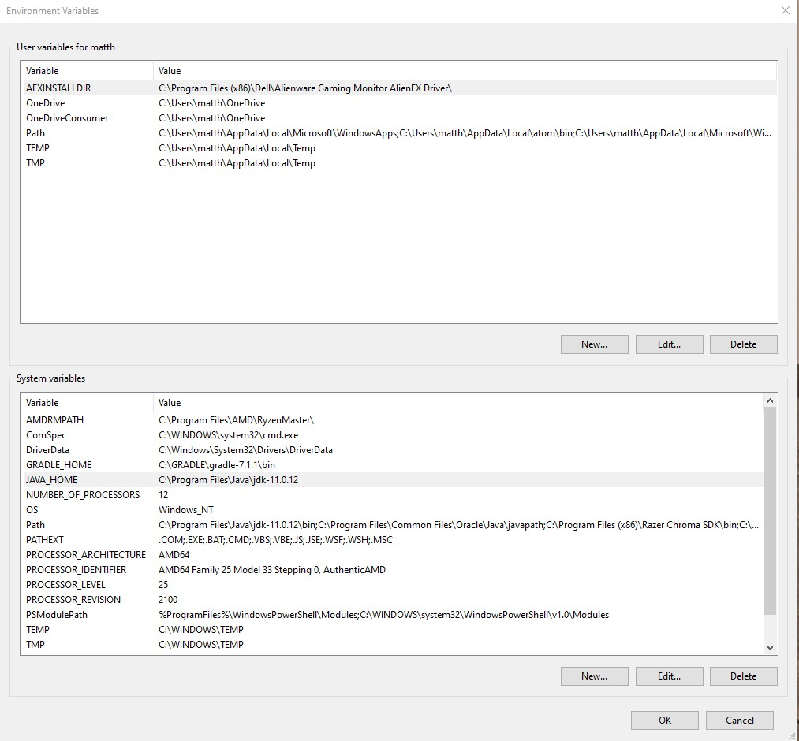
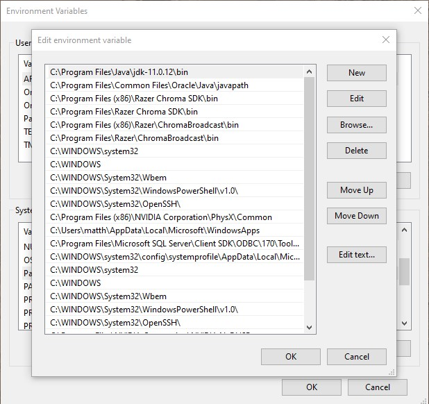
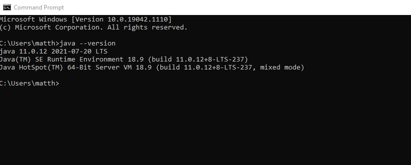
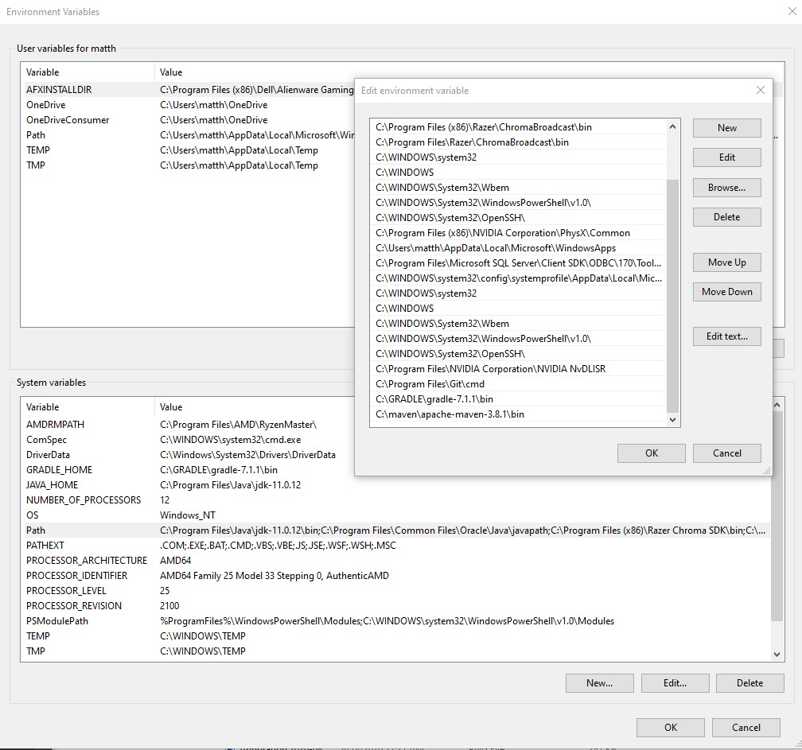
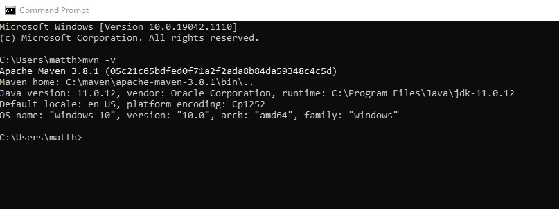
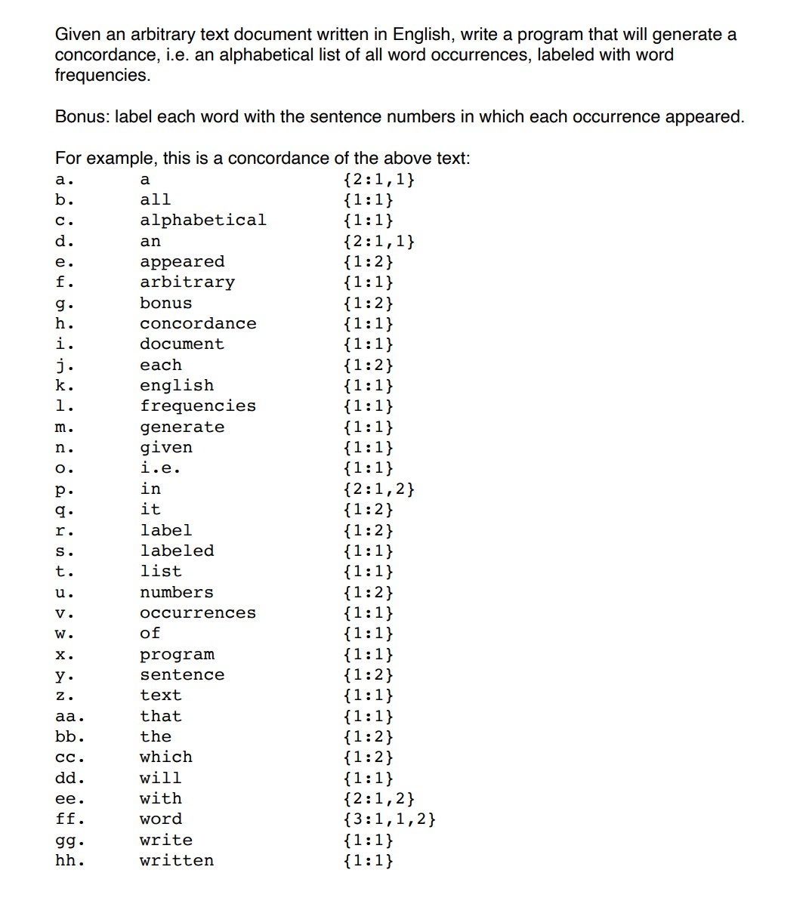

# Concordance Mapping
## System Setup: 
## Java
#### Install Java 11 or higher from here: https://www.oracle.com/java/technologies/javase-jdk16-downloads.html
#### Configure Environment Variables (Windows System): 
##### Create a JAVA_Home System Variable and point to the: `C: ~\jdk-11.0.12` directory

#####Create a new path within the 'path' System Variable that points to the `C: ~\jdk-11.0.12\bin` directory

##### Verify Java Installation and Environment Variable Setup through CLI:
`java --version`
##### It should show the java version, which should be Java 11 or higher: 

## Maven
#### Install Maven From Here: https://maven.apache.org/download.cgi and choose the zip download
#### Configure Environment Variables (Windows System): 
##### Unzip the Maven Download to your directory of choice and create a new path within the 'path' system variable that points to the `C: ~\maven\apache-maven-3.8.1\bin` directory 

##### Verify Maven Installation and Environment Variable Setup through CLI:

`mvn -v`

##### If correctly configured the command line will display the Maven version:

# Compile:
### cd into parent directory
`mvn package`

# Run the application:
from the ~\my-app directory

`java -cp target/my-app-1.0-SNAPSHOT.jar path.to.mainclass fileName.txt`

the test file test1.txt is included in the repository 

`java -cp target/my-app-1.0-SNAPSHOT.jar com.mycompany.app.App test1.txt`

