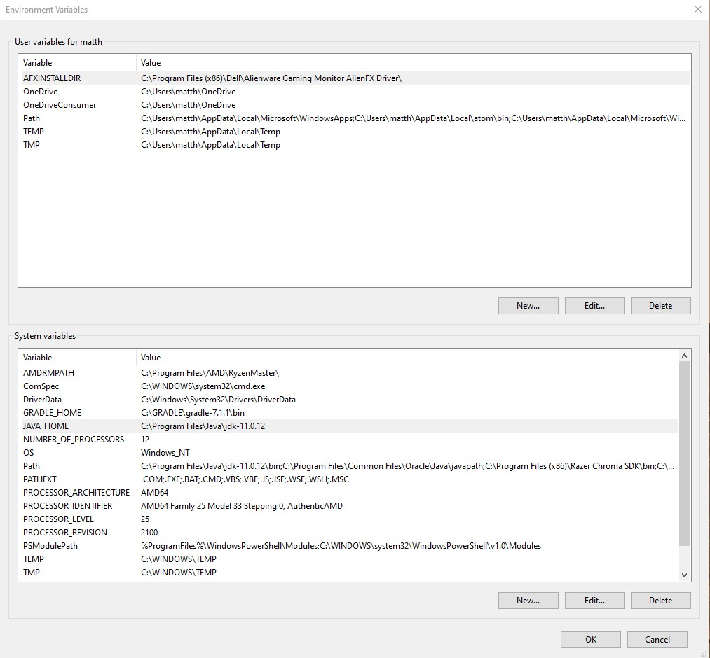
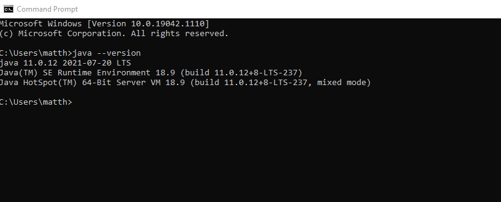
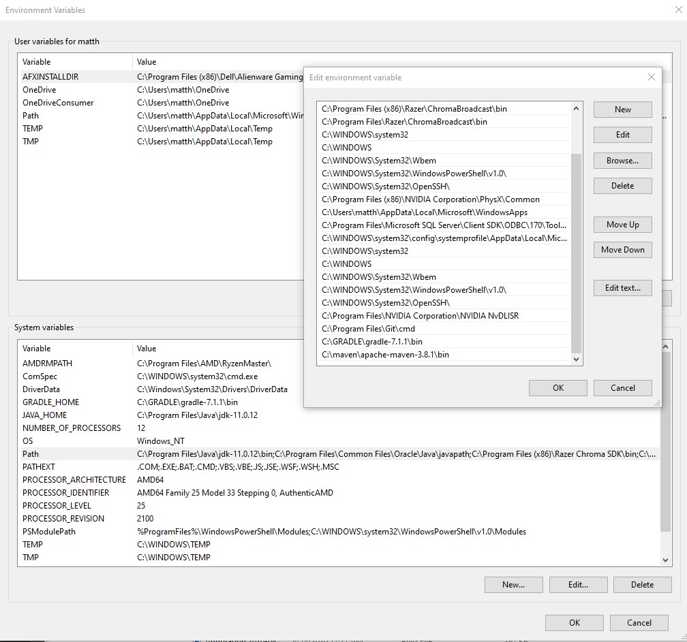

# Concordance Mapping
## System Setup: 
## Java
#### Install Java 11 or higher from here: https://www.oracle.com/java/technologies/javase-jdk16-downloads.html
#### Configure Environment Variables: 
##### JAVA_Home points to 
`C:\Program Files\Java\jdk-11.0.12`

##### Verify Java Installation and Environment Variable Setup through CLI:
`java --version`
##### It should show the java version: 

## Maven
#### Install Maven From Here: https://maven.apache.org/download.cgi
#### Configure Environment Variables: 
##### Within the Path System Variable Add A New Path to point to the bin folder of the unzipped download file from the maven download: 

##### Verify Maven Installation and Environment Variable Setup through CLI:
`mvn -v`

# Compile:
### cd into parent directory
`mvn package`

# Run the application:
from the *\my-app directory

`java -cp target/my-app-1.0-SNAPSHOT.jar com.mycompany.app.App fileName.txt`

the test file test1.txt is included in the repository 
`java -cp target/my-app-1.0-SNAPSHOT.jar com.mycompany.app.App test1.txt`

<object data = "/concordance%20.pdf" type ="application/pdf" width="100%">
</object>

